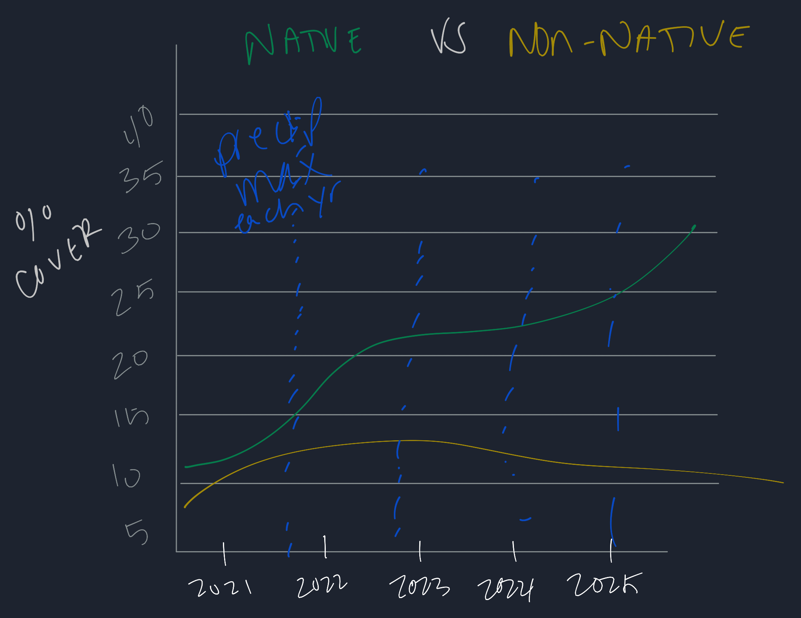
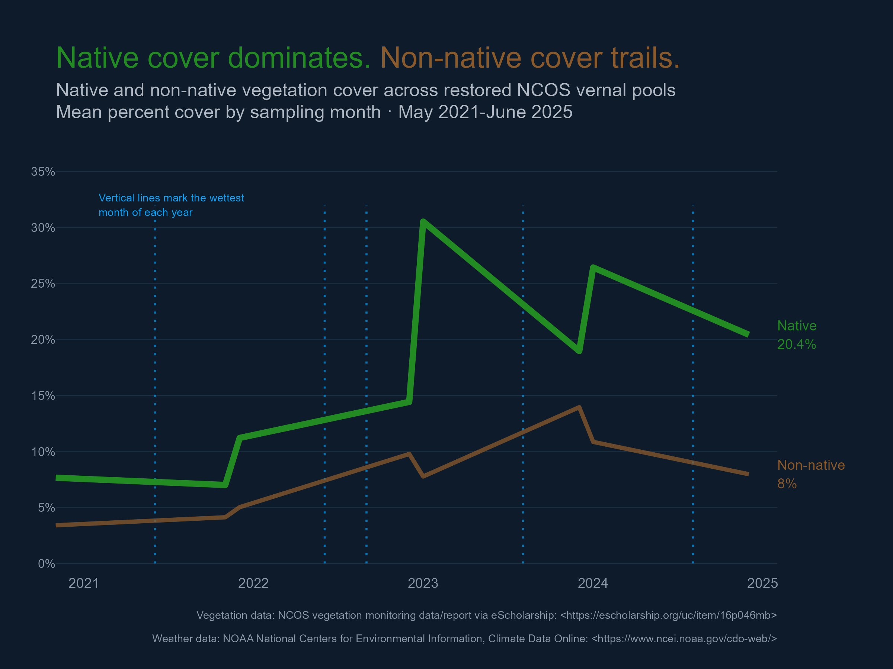

# Intermediate Elective 2

## General information

This repository contains materials for Intermediate Elective 2 for ENVS 193DD. The project uses Steven Ponce’s “Coal falls. Renewables rise.” visualization as a design template and adapts the style to vegetation and weather data from the North Campus Open Space (NCOS).

The final visualization compares native and non-native vegetation cover through time across restored NCOS vernal pools. Vertical annotation lines show the month with the highest precipitation in each year.

## Data and file information

```text
.
├── README.md
├── code
│   ├── intermediate-elective2.qmd
│   └── intermediate-elective2.pdf
├── data
│   ├── veg.csv
│   ├── vp_veg_metadata.csv
│   └── NOAA-weather-data.csv
└── images
    ├── native_nonnative_cover.png
    └── visual_sketch.png
```

Vegetation data are from NCOS vegetation monitoring data/report available through [eScholarship](https://escholarship.org/uc/item/16p046mb)

Weather data are from [NOAA daily weather records](https://www.ncei.noaa.gov/cdo-web/)

## Rendered output

- [Rendered Intermediate Elective 2 PDF](https://github.com/RebeccaLMartinez/intermediate-elective/blob/main/code/intermediate-elective2.pdf)

## Planned visual



## Final figure


    